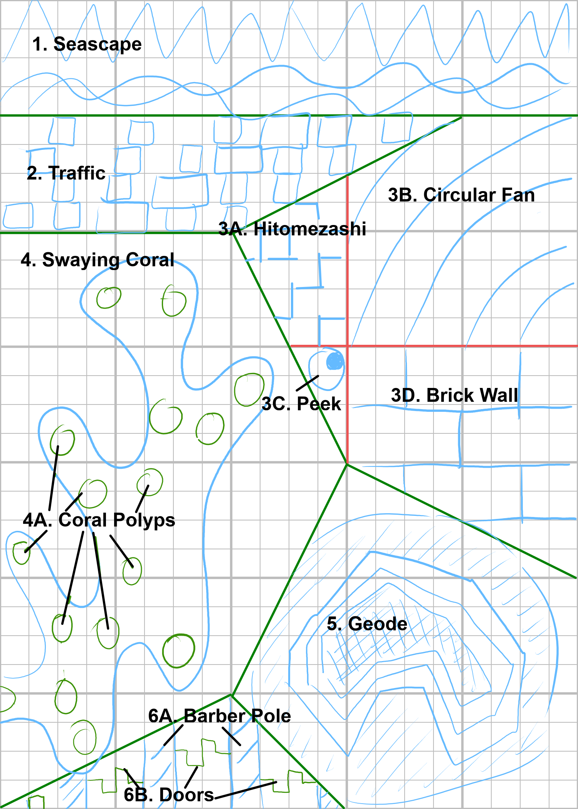
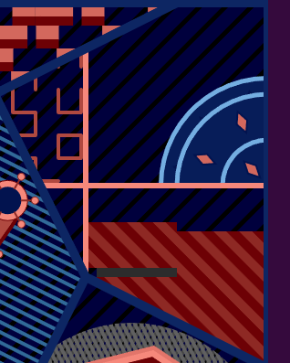
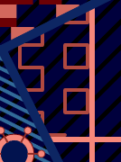
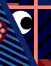
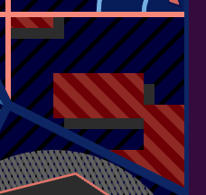
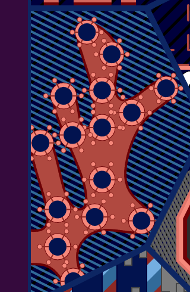
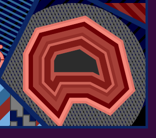
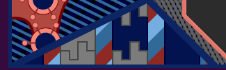

# Animated Tangle: Animation Breakdown

## Top Level: Animated Tangle

## Panel 1: Seascape

This animation is a view of mountains and ocean waves. I use the <a href="https://en.wikipedia.org/wiki/Parallax">parallax effect</a> to give it a sense of depth.

Fun fact: Originally the "waves" were supposed to be rolling hills. However, since my color palette used blue rather than green, it looked more like water.

## Panel 2: Traffic

## Panel 3: Quadrants

I subdivided panel 3 into 4 quadrants to make several animations

### Panel 3A: Hitomezashi

This panel features a hitomezashi stitching pattern with animated stitches.

I first learned about this Japanese sashiko embroidery technique from [this Numberphile video](https://www.youtube.com/watch?v=JbfhzlMk2eY). I've used this pattern before in my [`paper-toaster` project](https://github.com/ptrgags/paper-toaster?tab=readme-ov-file#hitomezashi-2022-06-17).

### Panel 3B: Circle Fan

IMG: Close up of Circle Fan fully extended

In my traditional art doodles, I often use a motif of circular arcs fanning out from the corner of a shape. To make an animated version, I imagined a somewhat mechanical motion. I wanted the circles to expand one step at a time.

For the diamond shapes, I arranged them by bisecting angles of key points in the previous row (including the sides). See the diagram below:

IMG: diagram of spacing pattern

### Panel 3C: Peek

When planning out this animation, I saw that I had a small triangle of space to work with. What could I tuck in there? A googly eye, obviously! 👀

### Panel 3D: Brick Wall

This panel is an animation of a wall being built brick by brick. To make it more interesting, I use the bricks as a clip mask that reveals a striped pattern.

The striped pattern is based on [Stripey Ring](https://ptrgags.dev/webgpu-sketchbook/#/sketch/stripey-ring) from my other repo, `webgpu-sketchbook`.

There's a certain rhythm to when the bricks snap into place.
I alternate between quarter notes and triplets. This way, every row of the wall takes the same time to build.

IMG: Diagram of rhythm `1 2|3 4 5|6 7|8 9 10`

## Panel 4: Coral

### Panel 4A: Coral Polyps

| Closed | Open |
|---|---|
|  |  |

## Panel 5: Geode

I love the look of geodes, especially the banding patterns of agate.

In real life, agates form when silica-rich water fills a crack in a rock and deposits a layer of crystal on the walls. When this happens repeatedly over time, you get bands of color growing inwards from the walls. See [This article from Geology In](https://www.geologyin.com/2016/02/how-do-agates-form.html) for more information.

I figured out a way to render such banding patterns. I take the boundary polygon and render it many times with different stroke widths.

I render the innermost color band first by using a very thick outline. Then, I render the second innermost band with a slightly thinner line, and so on.

| First Band                         | Second Band                       | Many Bands                         |
| ---------------------------------- | --------------------------------- | ---------------------------------- |
| IMG: Polygon with first band drawn | IMG: Polygon with two bands drawn | IMG: polygon with many bands drawn |

This produces lines both inside and outside the polygon. However, if we use the boundary polygon as a clip mask, we
can crop out the outside portion.

IMG: Cropped version - now it looks like a geode.

This geode rendering is very similar to what I did with
the Circulal Fan animation. The only difference is in the
timing. Circular Fan moves in steps for a mechanical feel,
but Geode grows continuously.

## Panel 6: Barber Pole and Doors

### Panel 6A: Barber Pole

IMG: The stripes with an arrow to show motion

To make the barber poles, I just used a set of stripes that scroll across the panel.

### Panel 6B: Doors

IMG: close up of the doors

This panel features doors that open and close, somewhat like jaws. I chose the timing carefully so the doors close one after another with a steady rhythm.

IMG: Rhythm
