# Animated Tangle: Animation Breakdown

| Screenshot | Labeled Panels |
|---|---|
| 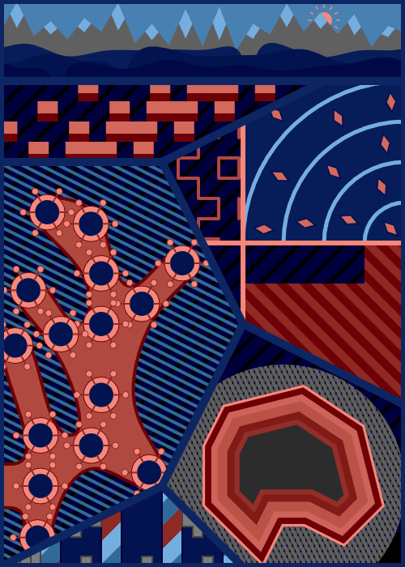||

## Top Level: Animated Tangle

I subidided the canvas into several polygonal shapes. I found myself referring
to them as "panels", like in a comic book.

I refer to using clipping masks to subdivide a region of the canvas as Vector Tangles.
This is because it's the vector art counterpart to [Raster Tangles](https://github.com/ptrgags/raster-tangles/tree/main). The latter operates on pixel art images.

## Panel 1: Seascape

This animation is a view of mountains and ocean waves. I use the <a href="https://en.wikipedia.org/wiki/Parallax">parallax effect</a> to give it a sense of depth.

Fun fact: Originally the "waves" were supposed to be rolling hills. However, since my color palette used blue rather than green, it looked more like water.

## Panel 2: Traffic

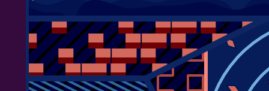

This animation started with an idea for the motion. The blocks move quickly, but slow down and get bunched up near the middle of the screen. After clearing the "traffic jam", the blocks speed up again.

The shading was a last minute addition, and gives me the impression of platforms floating on water.

## Panel 3: Quadrants

I subdivided panel 3 into 4 quadrants to make several small animations.

### Panel 3A: Hitomezashi

This panel features a hitomezashi stitching pattern with animated stitches.

I first learned about this Japanese sashiko embroidery technique from [this Numberphile video](https://www.youtube.com/watch?v=JbfhzlMk2eY). I've used this pattern before in my [`paper-toaster` project](https://github.com/ptrgags/paper-toaster?tab=readme-ov-file#hitomezashi-2022-06-17).

### Panel 3B: Circle Fan

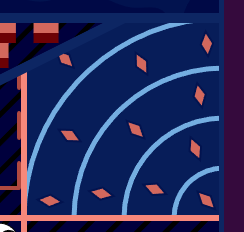

In my traditional art doodles, I often use a motif of circular arcs fanning out from the corner of a shape. To make an animated version, I imagined a somewhat mechanical motion. I wanted the circles to expand one step at a time.

For the diamond shapes, I arranged them by bisecting angles of key points in the previous row (including the sides). See the diagram below:

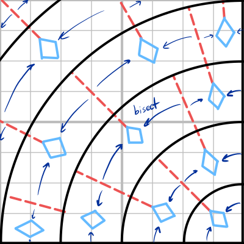

### Panel 3C: Peek

When planning out this animation, I saw that I had a small triangle of space to work with. What could I tuck in there? A googly eye, obviously! 👀

### Panel 3D: Brick Wall

This panel is an animation of a wall being built brick by brick. To make it more interesting, I use the bricks as a clip mask that reveals a striped pattern.

The striped pattern is based on [Stripey Ring](https://ptrgags.dev/webgpu-sketchbook/#/sketch/stripey-ring) from my other repo, `webgpu-sketchbook`.

There's a certain rhythm to when the bricks snap into place.
I alternate between quarter notes and triplets. This way, every row of the wall takes the same time to build.

| Brick Layout | Rhythm |
|---|---|
| 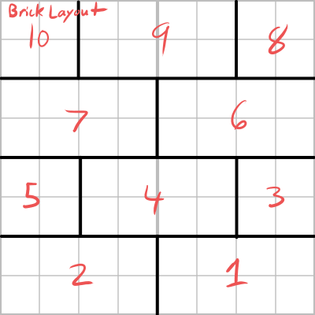 | 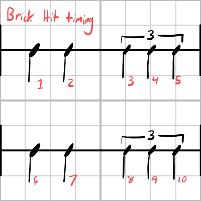 |

## Panel 4: Coral

Coral shapes are common motif in my artwork. In 2025, I was exploring different techniques to mimic the shape.
This technique is the best I've found so far! I create a tree structure, then trace a B-spline around the nodes.
I can set the radius of each node, and skip some points to help adjust the shape. Here is a diagram of the shape I'm trying to mimic, and a diagram of how the spline is constructed.

| Hand-drawn coral | Coral spline technique |
| --- | --- |
| 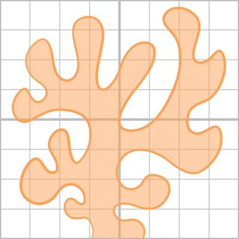 | 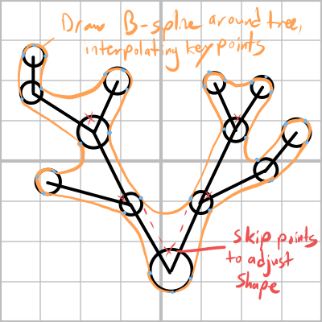 | 

Special thanks to Przemysław Prusinkiewicz (co-author of [_The Algorithmic Beauty of Plants_](https://algorithmicbotany.org/papers/#abop) and many other papers on algorithmic botany and L-systems). In an email thread with him about coral patterns, he suggested drawing a B-spline around a tree. In the end, that was a key insight. I only had to add a couple of details (adding the radii and skip points) to get it where I wanted.

My other attempts, like this [tile based approach](https://ptrgags.dev/p5-sketchbook/Coral/Maze/) were more complex and fizzled out. Going back to basics helped here.

I also made the coral sway a bit in the current - I did this by rotating some of the leaf nodes around their parent, as if on a hinge:

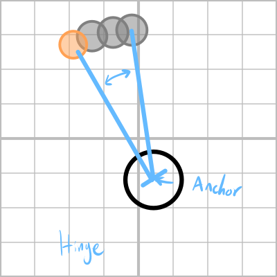

### Panel 4A: Coral Polyps

| Closed | Open |
|---|---|
|  |  |

A coral isn't one creature, but rather a colony of many small polyps (basically a mouth with tentacles). This animation is a stylized representation of the polyps. The tentacles retract quickly, as if in response to a threat, and cautiously open.

Here's a photo I took of a coral colony at the Adventure Aquarium in New Jersey that shows some real-life polyps:

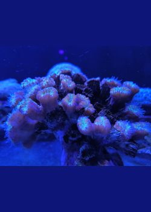

I also have a [3D version](https://ptrgags.dev/#/stereo-pair/undersea-3d/2025-04-16_FluorescentCoral) of this photo on my main website.

## Panel 5: Geode

I love the look of geodes, especially the banding patterns of agate.

In real life, agates form when silica-rich water fills a crack in a rock and deposits a layer of crystal on the walls. When this happens repeatedly over time, you get bands of color growing inwards from the walls. See [This article from Geology In](https://www.geologyin.com/2016/02/how-do-agates-form.html) for more information.

I figured out a way to render such banding patterns. I take the boundary polygon and render it many times with different stroke widths.
I render the innermost color band first by using a very thick outline. Then, I render the second innermost band with a slightly thinner line, and so on. This produces lines both inside and outside the polygon. However, if we use the boundary polygon as a clip mask, we can crop out the outside portion.

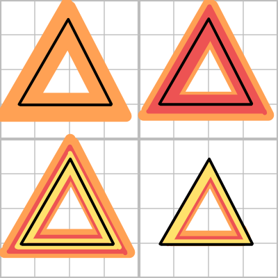

This geode rendering is very similar to the
the Circle Fan animation, in that it stacks layers from thickest to thinnest.
However, there is a notable difference in animation timing. Circular Fan moves in steps for a mechanical feel,
but Geode grows continuously.

## Panel 6: Barber Pole and Doors

### Panel 6A: Barber Pole

To make the barber poles, I just used a set of stripes that scroll across the panel as an animated background. Only small strips are visible, so it looks like the [barber pole illusion](https://en.wikipedia.org/wiki/Barberpole_illusion).

### Panel 6B: Doors

This panel features doors that open and close, somewhat like jaws. I chose the timing carefully so the doors close one after another with a steady rhythm.

## Original Concept Art

Like most of my creations, this animation began with a sketch on paper. Here's a scan of the main concept art diagram I was using for reference.

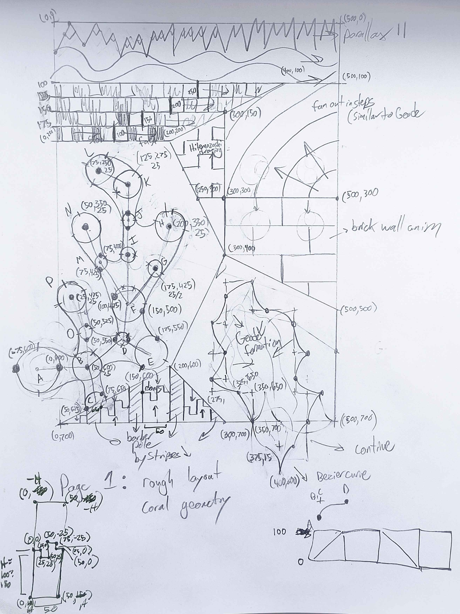

## A Year in Review

This animation is a culmination of many ideas I explored in 2025:

- Creating an algorithm to mimic the coral shapes I draw on paper
- Creating patterns inspired by nature
  - Coral
  - Geodes
  - Mountain/ocean view
- Animation via piecewise timing curves
  - My `AnimationCurve` class was inspired by my [musical experiments](https://ptrgags.dev/p5-sketchbook/SoundTest/) earlier this year.
  - I added [easing curves](https://easings.net/) for smoother animations in a few places
- Using clipping masks to nest patterns within each other
- Using `Primitive`s that can be composed into a scene graph of sorts.
- Making use of what I've learned from color theory[^1]
  - When picking colors, I used a relatively limited color palette. I only use a few hues (two blues and one coral) and limit myself to 5 lightness values.
  - I've been continuing to use the [Oklch](https://oklch.com/) perceptual color space. It makes it a lot easier to choose colors and create gradients.

## Footnotes

[^1]: I highly recommend _Artists' Master Series: Color & Light_ by Pickard et al. It gives a thourough look at color theory and other related concepts.
