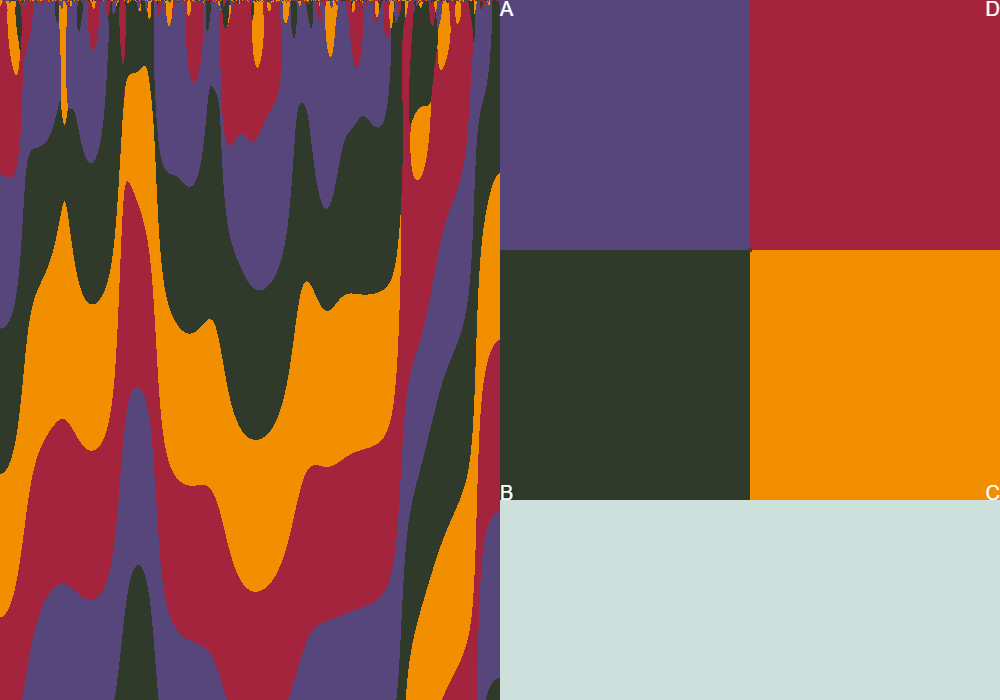
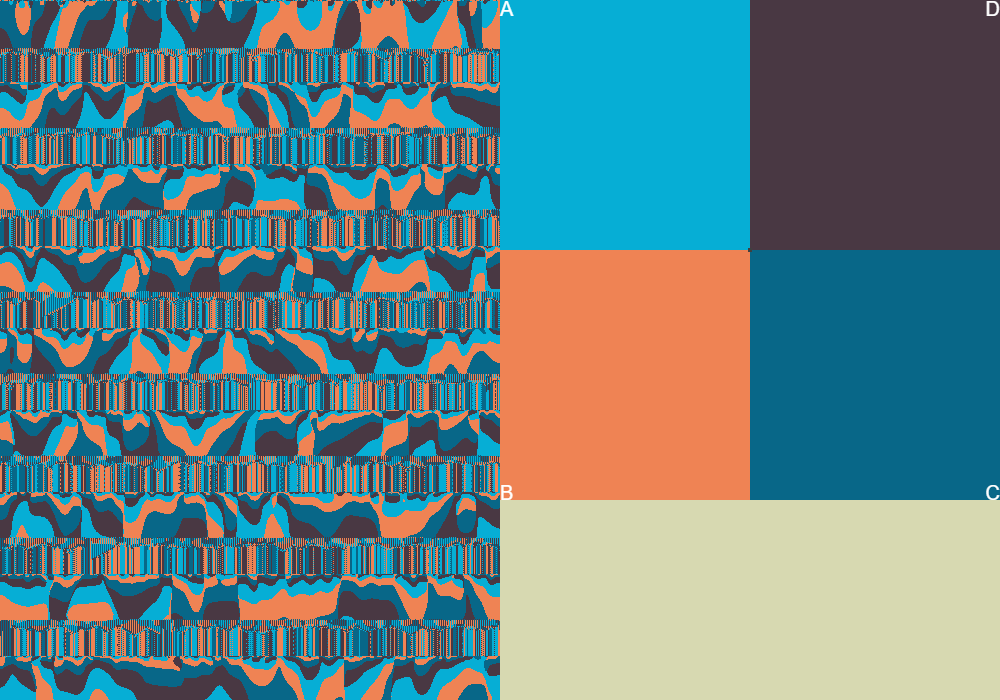

# Autocatalysis

## 2021-07-30 Initial Experiments

Yesterday and today I worked on implementing the differential equations for
[Autocatalysis](https://en.wikipedia.org/wiki/Autocatalysis#Far_from_equilibrium)
except I made the system general enough to handle 4 chemical species. This
involved:

* Parsing equations like `A + 2B -> C` or `A + 2B + C <-> D`. Both forward
    and reversible reactions are supported
* Integrating the differential equations
* Rendering the results. I render the value with the maximum concentration,
    but it would be good to think of other coloring methods. Perhaps interpolate
    between the 4 colors using the relative concentrations as weights?


Here's one interesting result from experimenting with coupled equations:

```
A + B -> C
2C -> D + B
3D -> A
```

In the image below:
* A = purple
* B = dark green
* C = yellow
* D = red


I'm out of time this morning, I'll analyze what's going on here later

Next Steps:

* Experiment with more equations - can I find a system that oscillates naturally?
* Experiment with rendering methods
  * Interpolate color palette
  * Try making some sort of phase space plot to see what's going on?


## 2021-07-31 Phase Plots, More Terms

Today I added a sort of phase plot, though not the usual sort. Since there
are four chemicals, I'd need 4 dimensions. Instead of that, I decided to
put the four chemicals at the corners of a square and interpolate based
on normalized values. This is helpful, though I need to find a better way
to distinguish points that overlap.

I also added a bunch of other terms to the equation:

* Diffusion
* Exponential Growth/Decay
* Constant rates

I still find it hard to control, but somehow I managed to make this:



The relevant parameters here are:

```
reactions (-> reaction rate: 0.01)
A -> B
B -> C
C -> D
D -> A

diffusion: 0.4 for all chemicals
initial concentration: random values
```

Next steps:

* Try to get a working predator/prey model working
* Consider float coefficients
* Better coloring for the texture
* Determine how to distinguish points on the phase plot


## 2021-08-02 More Parameters

I added more parameters. Lots of parameters:

* I expanded the linear coefficients into a whole matrix with the intent of making solutions that circle around in phase space. Didn't quite work the way I
expected. Not sure why, probably it's the scaling factor that turns it into a spiral sink.
* I added some logic to reflect negative values. Not really sure what to do here but this works.

I still wasn't happy with the fact that diffusion tends to muddy the results
by making the points converge on the average. So I tried making the diffusion
rate _negative_ to exaggerate differences. The results seem to result in chaotic paths (or maybe that's float precision?)

But the problem is values can diverge too far as well. That's not good.

So tired me had an idea: What if I flipped the sign of the diffusion
coefficient every so often? this way it doesn't converge or diverge too much.

I tried this, flipping the sign every so many frames. This works surprisingly
well, it tends to produce horizontal stripes. Though I need to control
the timing better to avoid stretched out portions if possible.

This time I used a cumulative sum of each chemical to seed the
initial row.

The results of all this? WOW:



Relevant parameters for the above

```
Diffusion rates: 0.1 (sign flips every 41 frames)
Delta time: 0.1
Iterations per frame: 100
Reactions: (reaction rate 0.01 for all)
2A -> B
2B -> C
2C -> D
2D -> A
```

Next Steps:

* Try playing with the diffusion rate. Maybe the reversal should be
    proportional to how close the point is to the boundary (too extreme) or to the center (too muddy)?
* Try cyclicly shifting the values every so often. I just want to see what happens.
* Clean up the parameters, and save presets