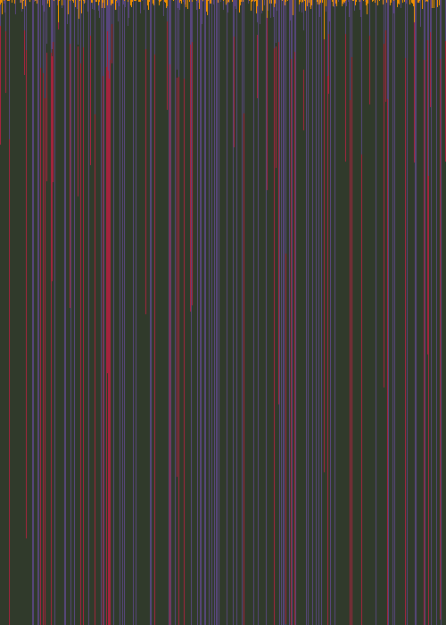

# Autocatalysis

## 2021-07-30 Initial Experiments

Yesterday and today I worked on implementing the differential equations for
[Autocatalysis](https://en.wikipedia.org/wiki/Autocatalysis#Far_from_equilibrium)
except I made the system general enough to handle 4 chemical species. This
involved:

* Parsing equations like `A + 2B -> C` or `A + 2B + C <-> D`. Both forward
    and reversible reactions are supported
* Integrating the differential equations
* Rendering the results. I render the value with the maximum concentration,
    but it would be good to think of other coloring methods. Perhaps interpolate
    between the 4 colors using the relative concentrations as weights?


Here's one interesting result from experimenting with coupled equations:

```
A + B -> C
2C -> D + B
3D -> A
```

In the image below:
* A = purple
* B = dark green
* C = yellow
* D = red



I'm out of time this morning, I'll analyze what's going on here later

Next Steps:

* Experiment with more equations - can I find a system that oscillates naturally?
* Experiment with rendering methods
  * Interpolate color palette
  * Try making some sort of phase space plot to see what's going on?


## 2021-07-31 Phase Plots, More Terms

Today I added a sort of phase plot, though not the usual sort. Since there
are four chemicals, I'd need 4 dimensions. Instead of that, I decided to
put the four chemicals at the corners of a square and interpolate based
on normalized values. This is helpful, though I need to find a better way
to distinguish points that overlap.

I also added a bunch of other terms to the equation:

* Diffusion
* Exponential Growth/Decay
* Constant rates

I still find it hard to control, but somehow I managed to make this:


The relevant parameters here are:

```
reactions (-> reaction rate: 0.01)
A -> B
B -> C
C -> D
D -> A

diffusion: 0.4 for all chemicals
initial concentration: random values
```

Next steps:

* Try to get a working predator/prey model working
* Consider float coefficients
* Better coloring for the texture
* Determine how to distinguish points on the phase plot


## 2021-08-02 More Parameters

I added more parameters. Lots of parameters:

* I expanded the linear coefficients into a whole matrix with the intent of making solutions that circle around in phase space. Didn't quite work the way I
expected. Not sure why, probably it's the scaling factor that turns it into a spiral sink.
* I added some logic to reflect negative values. Not really sure what to do here but this works.

I still wasn't happy with the fact that diffusion tends to muddy the results
by making the points converge on the average. So I tried making the diffusion
rate _negative_ to exaggerate differences. The results seem to result in chaotic paths (or maybe that's float precision?)

But the problem is values can diverge too far as well. That's not good.

So tired me had an idea: What if I flipped the sign of the diffusion
coefficient every so often? this way it doesn't converge or diverge too much.

I tried this, flipping the sign every so many frames. This works surprisingly
well, it tends to produce horizontal stripes. Though I need to control
the timing better to avoid stretched out portions if possible.

This time I used a cumulative sum of each chemical to seed the
initial row.

The results of all this? WOW:


Relevant parameters for the above

```
Diffusion rates: 0.1 (sign flips every 41 frames)
Delta time: 0.1
Iterations per frame: 100
Reactions: (reaction rate 0.01 for all)
2A -> B
2B -> C
2C -> D
2D -> A
```

Next Steps:

* Try playing with the diffusion rate. Maybe the reversal should be
    proportional to how close the point is to the boundary (too extreme) or to the center (too muddy)?
* Try cyclicly shifting the values every so often. I just want to see what happens.
* Clean up the parameters, and save presets

## 2021-08-03 Insights

After sleeping on it, I had a few interesting insights:

### Redundant Terms

First of all, I realized that several terms are technically redundant!
If you work out the autocatalysis equations, you get these equivalences:

| Chemical Equation | Equivalent ODEs | Description |
|-------------------|-----------------|------------|
| `-> A` | `dA/dt = k(1-0)A^0 = k` | constant increase |
| `A ->` | `dA/dt = k(0-1)A^0 = -k` | constant decrease |
| `A -> 2A` | `dA/dt = k(2-1)A^1 = kA` | exponential increase |
| `-> -1A` (hear me out...) | `dA/dt = k(-1 - 0)A^0` | exponential decrease |
| `A -> A + B` | `dA/dt = 0`, `dB/dt = k(1-0)A^1 = kA` | B grows proportional to A |
| `A -> A + -1B` (hear me out...) | `dA/dt = 0`, `dB/dt = k(-1 - 0)A = -kA` | B decreases proportional to A |

The first two equations mean you can express constant increases/decreases.
The second two equations mean you can express exponential growth/decay
(albeit decay requires negative coefficients). The last two equations can
be used to represent all the other possible linear terms.

This means, technically speaking I could get away without constant or linear terms. However, this would require many equations. It would be more
efficient (and easier to read) to just use the rate coefficients. Use
the actual chemical equations for expressing non-linear terms.

One other takeaway is that the chemical equations are not very intuitive.
`A -> 2A` represents exponential growth, but `2A -> A` does NOT represent
exponential decay, as it's a quadratic term `dA/dt = k(1-2)A^2 = -kA^2`.
I should keep this in mind when experimenting.

### Tone Mapping

I'm still trying to determine a way to handle the fact that chemical values
can easily grow very large or even negative.

And this reminded me of one thing from doing physically-based rendering at
work: tone-mapping is one way to map `[0, inf) -> [0, 1)`. With some slight
modifications, you can extend this so the domain can be negative. Depending
on whether the result should be signed or unsigned, here are a couple options:

```
f(x) = |x| / (1 + |x|)  // maps (-inf, inf) -> [0, 1)
g(x) = x / (1 + |x|)    // maps (-inf, inf) -> (-1, 1)
```

Though of course, these are not unique. Like actual tonemapping, you might want
to adjust the curve so it is closer to 1 or closer to 0.

I tried using this to make weights so I can interpolate colors. It works,
though interpolating in RGB space doesn't work well. I'll need to keep
thinking.

### Cyclic Shifts

Running out of time this morning, I hastily slapped in some code to
shift the domain every so many frames. The results give stripy patterns:


Two issues with this:

1. It introduces noticeable seams where the shift happens. Maybe I need to find a bettter way that blends values. Similar to diffusion, just more directional. (or is this representable by advection?)
2. Need to think through the interaction between this and the boundary clamping.
3. Right now I only shift one direction, it would be more interesting to vary the shift direction and amount

### Shell History

At this point, there's several different parts to this simulation tied
to the number of frames:

* Reaction & Diffusion for some number of iterations per frame
* Reversing the diffusion direction every so often
* Shifting the domain every so often
* (eventually) shrinking/growing the domain size
* (eventually) regulating the chemicals somehow for more interesting patterns?

Right now I've been doing these by testing `frameCount % event_frequency === 0`. But this is somewhat lazy, and I need this to be done in lockstep with
other parts of shell generation.

So here's one idea: generate a history of the shell. This is a list of
events such as "perform n iterations of reaction/diffusion" or "shift domain 1 place to the right" or "grow the domain at these points". This can be generated
all at once, or incrementally. Then this program should interpret that as applying the relevant math to the chemical concentrations.

Similarly, this would apply to the other parts of this seashell generation
(differential growth for the cross section and curvature/torsion of the shell).
There would have to be some cross-communication, e.g. it's the differential
growth simulation that would control the size of the domain based on the
number of vertices. Though if this can be avoided, that would be best, as
I'd rather not interleave 3 different simulations.

### Next Steps:

* Document this shell history idea in my `super-seashells` repo
* Rephrase in terms of shell history
* Think of a better method of picking colors
* Try shrinking/growing the domain size
* Add a regulation step

## 2021-08-05 Cleanup

Today I started reorganizing the code before continuing. The chemical
concentration data structure is now moved to its own file. I also created
a `SeashellTexture` and `ReactionDiffusion` classes to encapsulate the
main logic. This will also make it easy to make presets.