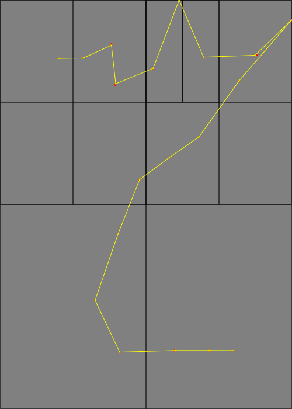

## Differential Growth 2D

### 2021-07-23 Initial Work

Today I started implementing a 2D differential growth simulation starting
from a polyline. This is based on:

* [This Medium article by Jason Webb](https://medium.com/@jason.webb/2d-differential-growth-in-js-1843fd51b0ce)
* [Differential Line](https://inconvergent.net/generative/differential-line/) and
    other related articles from inconvergent.net

So far I've done the following:
* Created a quadtree data structure. This is necessary since repulsion forces
    require a list of nearby neighbors
* Allowing this quadtree to be updated when the points move out of their
    bounding boxes
* Creating a polyline data structure where the nodes are subject to attraction
    and repulsion forces
* Randomly inserting points in the polyline

However, the results aren't quite looking right (too jagged)

I see a few differences:

* I'm doing a _force_ based method, but I see now that [Jason Webb's code](https://github.com/jasonwebb/2d-differential-growth-experiments/blob/master/core/Path.js)
    is using `lerp()` between points. I should see how the other example does this
    for comparison. This difference is likely the biggest
* Jason Webb uses an R-tree for the spatial data structure. However, I realized
    that a quadtree should work just fine here, as it's not really
    k-nearest-neighbors but any number neighbors that are close by. Though this
    does not affect the look, just the performance.
* Webb also has a curvature-based line division method. Not 100% sure what he
    meant by that, I presume measuring the angle formed by 3 successive points?
    I should examine the reference code closer.

The forces I used are these:

* Attraction: I'm modeling the polyline as a bunch of nodes connected by springs
* Repulsion: Each node is repelled by any nodes within some radius.

I also clamp points that go out of bounds. Though I don't like the look.
Perhaps I need to also set the acceleration and velocity to zero when I do
this?
    
I also learned in the process that querying a quadtree by a circle is straightforward:
    1. Compute a tight bounding square around the circle (`center +/- radius`
        in both directions)
    2. Query the quadtree using the bounding square
    3. Filter the resulting points by testing intersection with a circle.

if I want to add points by curvature, I think this can be done without
trig functions, just by looking at the magnitude of the dot product to determine
how big the angle is.

Next Steps:
* Consider how to clamp points better. Clamp velocity? Have a force to push
    points away from the edge?
* Determine why the lerp method works better. Can I replicate it with a force
    based system? the `lerp` calls are probably faster but seems further removed
    from the physics
* Try adding points by curvature. 
* See if I can add constraints (e.g. stay within a circle, line or rectangle)
* Try multiple polylines at once
* After a while, I seem to hit a bug where a point is not redistributed
    properly. I need to investigate this further.