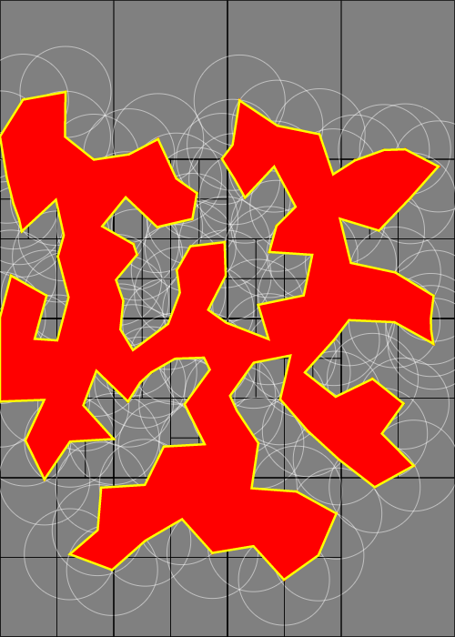
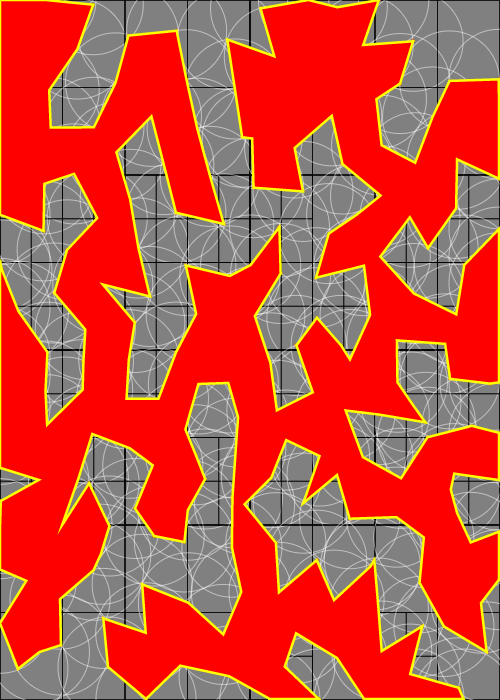
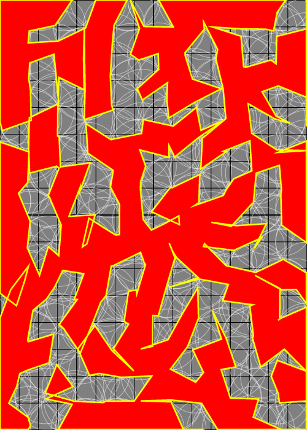
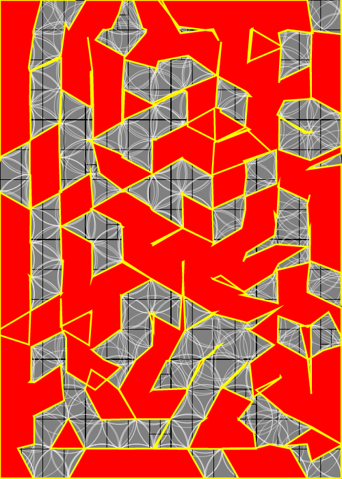
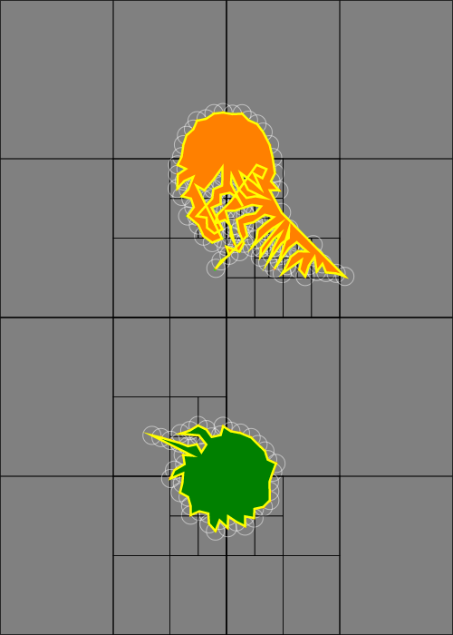
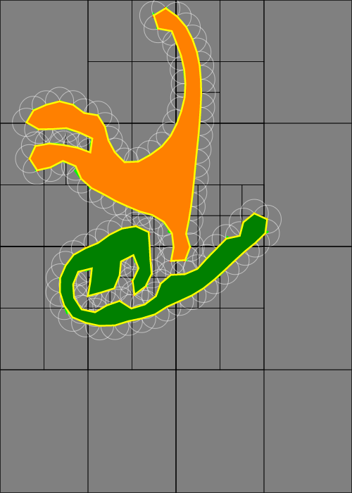
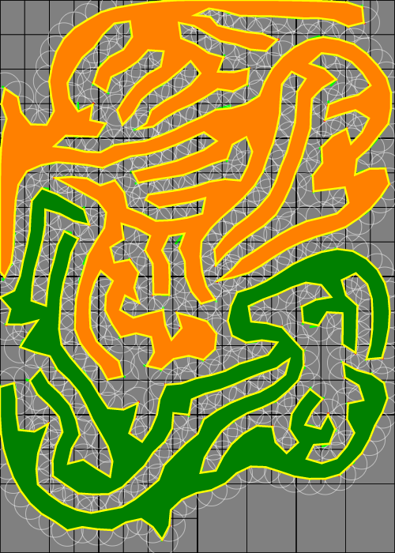

## Differential Growth 2D

### 2021-07-23 Initial Work

Today I started implementing a 2D differential growth simulation starting
from a polyline. This is based on:

* [This Medium article by Jason Webb](https://medium.com/@jason.webb/2d-differential-growth-in-js-1843fd51b0ce)
* [Differential Line](https://inconvergent.net/generative/differential-line/) and
    other related articles from inconvergent.net

So far I've done the following:
* Created a quadtree data structure. This is necessary since repulsion forces
    require a list of nearby neighbors
* Allowing this quadtree to be updated when the points move out of their
    bounding boxes
* Creating a polyline data structure where the nodes are subject to attraction
    and repulsion forces
* Randomly inserting points in the polyline

However, the results aren't quite looking right (too jagged)


I see a few differences:

* I'm doing a _force_ based method, but I see now that [Jason Webb's code](https://github.com/jasonwebb/2d-differential-growth-experiments/blob/master/core/Path.js)
    is using `lerp()` between points. I should see how the other example does this
    for comparison. This difference is likely the biggest
* Jason Webb uses an R-tree for the spatial data structure. However, I realized
    that a quadtree should work just fine here, as it's not really
    k-nearest-neighbors but any number neighbors that are close by. Though this
    does not affect the look, just the performance.
* Webb also has a curvature-based line division method. Not 100% sure what he
    meant by that, I presume measuring the angle formed by 3 successive points?
    I should examine the reference code closer.

The forces I used are these:

* Attraction: I'm modeling the polyline as a bunch of nodes connected by springs
* Repulsion: Each node is repelled by any nodes within some radius.

I also clamp points that go out of bounds. Though I don't like the look.
Perhaps I need to also set the acceleration and velocity to zero when I do
this?
    
I also learned in the process that querying a quadtree by a circle is straightforward:
    1. Compute a tight bounding square around the circle (`center +/- radius`
        in both directions)
    2. Query the quadtree using the bounding square
    3. Filter the resulting points by testing intersection with a circle.

if I want to add points by curvature, I think this can be done without
trig functions, just by looking at the magnitude of the dot product to determine
how big the angle is.

Next Steps:
* Consider how to clamp points better. Clamp velocity? Have a force to push
    points away from the edge?
* Determine why the lerp method works better. Can I replicate it with a force
    based system? the `lerp` calls are probably faster but seems further removed
    from the physics
* Try adding points by curvature. 
* See if I can add constraints (e.g. stay within a circle, line or rectangle)
* Try multiple polylines at once
* After a while, I seem to hit a bug where a point is not redistributed
    properly. I need to investigate this further.

## 2021-07-24 Steering

No new code today, but I read [Jason Webb's code](https://github.com/jasonwebb/2d-differential-growth-experiments/blob/master/core/Path.js)
a little more carefully today. I see he computes the position as:

```
position = lerp(position, nextPosition, maxVelocity)
```

and the "forces" modify `nextPosition`, also with `lerp()`s, along the lines
of this:

```
nextPosition(0) = position
// many equations similar to this:
nextPosition = lerp(nextPosition, target, maximumValue)
```

This compounded lerping means this behavior is actually quite involved,
a vector-valued polynomial in general. It's not a Bezier curve, but it
reminds me of it.

### Mathematical Aside: Lerp and Moving Towards a Target

I had one interesting observation about the first equation, repeated here:

```
position = lerp(position, nextPosition, maxVelocity)
```

Suppose `nextPosition` is some constant position, a faraway `target` if you will.
then you can expand the lerp as follows:

```
position = (1 - maxVelocity) * position + maxVelocity * target
         = position - maxVelocity * position + maxVelocity * target
         = position + maxVelocity * (target - position)
```

I observe:

* This looks like the kinematics equation `x_f = x_0 + delta_t * velocity`
* `maxVelocity` thus acts like the time step `delta_t`
* And `target - position` is like the velocity.
* This velocity is defined in terms of the position, so this is _not_ linear

But now let's think about that last point as an ordinary differential equation:

```
x(0) = x0 // initial position
dx/dt = target - x
// looks like exponential decay!

Guess:
x(t) = Ae^(-t) + B
dx/dt = -Ae^(-t)

Substitute:
dx/dt = target - x
-Ae^(-t) = target - (Ae^(-t) + B)
       0 = target - B
       B = target

Initial conditions:
x0 = x(0)
x0 = Ae^(-0) + target
(x0 - target) = A

Solution:
x(t) = (x0 - target)e^(-t) + target
```

In other words, the point approaches the target following an
_exponential decay_ curve in time! See [This Desmos sketch](https://www.desmos.com/calculator/by8yaee2ah). 
This was surprising to me since `lerp()` is _linear_ interpolation. 

An interesting consequence is the point will never actually reach the target,
only approach it.

### Connection: Boids and _The Nature of Code_

This lerp behavior seemed familiar, it reminds me of Boids flocking
simulations and steering forces. 

I returned to the book _The Nature of Code_ by Daniel Shiffman which is where
I first learned about this. [Chapter 6](https://natureofcode.com/book/chapter-6-autonomous-agents/) talks all about steering forces, including
attraction, repulsion, moving towards a target, etc. I plan to read this
further and rephrase differential growth in terms of autonomous agents before
continuing.

### Next Steps

* Reformulate the attraction, repulsion and boundary forces in terms of
    autonomous agents
* Implement this

## 2021-07-25 A Lot Closer

|  |  |
|--|--|
| |  |

I tried describing the differential growth in terms of steering forces.
It's working a lot better!

* Attraction works by setting the desired velocity to `neighbor - node`,
    limited in magnitude to some maximum speed. This only is applied if
    the node is at least some distance away from the neighbor (as if
    pulled back by stretching
* Repulsion works by computing the direction away from each nearby point
    and summing them to get an average direction. Again, limit this
    to a maximum speed
* All steering forces are computed as `desired_velocity - node.velocity`


This works well at first, but if there's too many nodes, it can get messy:



### Next Steps

* Figure out how to keep the points within some boundary shape
    (circles or rectangles)
* Debug the quadtree point redistribution a little bit, it sometimes breaks
* Try multiple polylines
* Add coloring
* See how the linked sources handled dividing the curve, there might be
    details I'm missing.
* Move parameters to a struct for presets as usual.
* Color points with a palette
* Play with the mass of the nodes. Older nodes are more massive
    (as if by growth)

### Bonus: Convergence to Triangles?!?!

While I was writing up this log entry, I left the sketch running for a long while. I see that the points arange themselves into an approximate equilateral
triangle grid:



Not sure why this is the case. I wonder if it has anything to do with
honeycombs, but those create hexagons, not equilateral triangles. I'll
have to think about this.

## 2021-07-27 Splitting Edges

Today I worked on adding more edge splitting behaviors:

* If edges get too long, split them in the middle
* Every so often, check the angles between each pair of edges. If the angle
    is too sharp, add a node

The latter needs to be done somewhat infrequently, otherwise the quadtree gets
overwhelmed with many nodes in the same spot

I still see self-intersections sometimes, not sure why yet.

### Side note: a lead on the out-of-bounds bug

Along the way, I found a lead on why the out-of-bounds bug still sometimes
happens. Somehow the quadtree bounds is becoming very small, so one of the
intervals becomes `[WIDTH - 1, WIDTH - 1)` which is an empty interval, no
points could possibly be in bounds.

I still need to investigate why this is happening, but at least I now know
what to look for.

### Next Steps

* Color the nodes by how they were created (initial, edge split, etc)
* Investigate the self-intersections
* Play with parameters - how to make this more curvy?

## 2021-08-23 Multiple Polylines

Today I tried adding a second polyline. I also played with the parameters a bit 
to try to make the results be more curvy and less pointy. Reducing the mass
of the points so they react faster to the forces, decreasing the radii for
attraction and repulsion, and increasing the rate of adding nodes definitely
helped:

| | | |
|--|--|--|
||||

### Next Steps

* Try a quadtree larger than the canvas
* also try different rules for bounding the growth. When I port this to Python,
    the boundary will likely be circular.