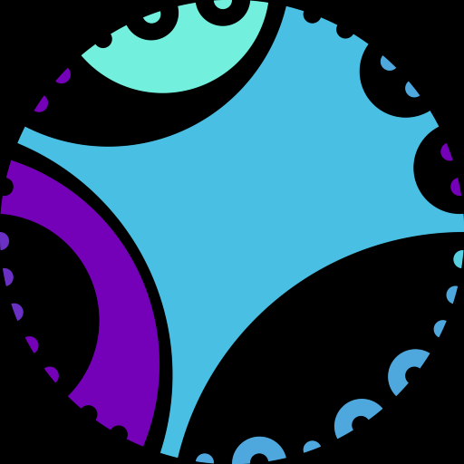
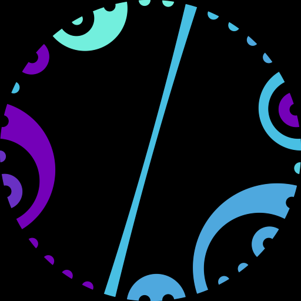
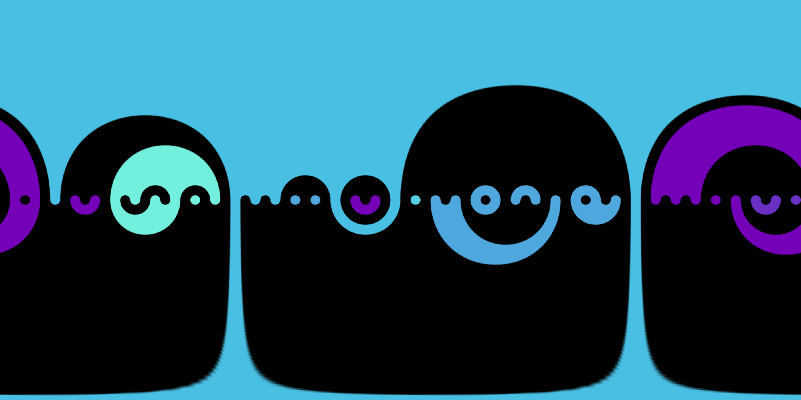

# Hyperbolic Connections (2021)

Sketch for generating abstract patterns on the Poincaré disk like these:

| North Hemisphere | South Hemisphere |
|--|--|
| |  |

This sketch generates multiple images at once, this is so I can generate
images that I can stitch together into a "panorama" using my 
[panoramas script](https://github.com/ptrgags/panoramas). This script now
has an option to combine 2 stereographic projections into a single
equirectangular image to texture a sphere. See the section [Beyond the Sketch](#beyond-the-sketch) for more information about this

## Usage

Run the sketch. You will get a pair of patterns on the screen by default.
There are several settings you can adjust in the sketch, see the comments
in the code. At present, these settings are not exposed at runtime.

## Background

This idea came from patterns I draw by hand like these:

TODO: Diagram

These patterns work as long as there are an even number of boundary points,
since you always connect two points at a time. When choosing connections,
you can only connect two boundary points if there are an even number
of other boundary points in between, otherwise you make it impossible to
finish the diagram without crossing lines:

TODO: Diagram

How would I make a digital version? Given that the shape of the boundary
doesn't matter (just how many boundary points and how they're connected), 
I tried doing so with a circle. The boundary points can always be connected
with a circle that is orthogonal to the boundary. Another way to think about
this is I'm drawing geodesics in the [Poincaré disk model](https://en.wikipedia.org/wiki/Poincar%C3%A9_disk_model) of the hyperbolic plane. That
would look something like this:

TODO: Diagram

From there, I just needed a way to randomly generate these circles.

## Random Boundary Generation

One observation is that the circle fill patterns act like pairs of balanced
brackets when you walk around the boundary counterclockwise. 
This even works with multiple colors, just treat each color like a different
kind of bracket/brace/parenthesis.

TODO: Diagram

### Structure of the Strings

To generate multiple patterns at once to cover a whole sphere, we need to make
sure they line up at the equator. This requires:

1. There needs to be the same number of boundary points
2. The colors must match up on the boundary.
3. Colors should be filled the same way on both spheres.
4. Wherever the pattern has lines that touch the boundary, the angle must be
    reversed between northern and southern hemispheres.

TODO: Diagram of point 4

We need to adhere to these rules, but otherwise we want to make the patterns
as varied as possible.

To handle rules 1 and 2, I generate all the strings at once in lockstep, chunks
at a time. Each chunk has a single color, but the color is randomly selected
from a palette (color choice represented below as `A`, `B` or `C`).

```
Remaining length:     20
.                <-- Dot indicates randomly selected insertion point
AA.AAAA               14
AABBBBAA.AA           10
AABB.BBAACCCCCCAA      4
AABBAAAABBAACCCCCCAA   0
```

In order to satsify rules 2 and 3, I only insert chunks at even indices of the
boundary, otherwise sometimes there's inconsistencies between north and south
hemispheres. There might be more sophisticated ways of doing this, but this
works well enough for me.

To ensure that colors match, I use a simple odd/even fill rule. If an opening
bracket is at an even position in the string, that circle is filled, otherwise
the background color will be used.

Since the circles are chosen to be orthogonal to the boundary, rule 4 is always
satisfied. However, if the image is warped at all in the shader (I may explore
this more in the future), I'd need to be careful to twist one hemisphere
clockwise and the other one counterclockwise.

To add random variation, each chunk can be any pair of balanced brackets of
a single color and a fixed length. See the [Generating a Chunk](#generating-a-chunk)
section below for more details.

### Generating a Chunk

The algorithm for generating a single chunk is pretty straightforward. Given
a desired length, randomly add pairs of brackets so the result is always
balanced:

```
Pairs remaing:  5
.      <-- the dot indicates where the next pair of brackets will go
[].             4
[.][]           3
.[[]][]         2
[][[].][]       1
[][[][]][]      0
```

## Computing Orthogonal Circles

I didn't know how to compute orthogonal circles going into this. I found
two ways:

### Method 1: Intersect Tangents

TODO: Explain

### Method 2: Kite Analysis

TODO: Explain

## Rendering

TODO: Explain

## Beyond the Sketch

This sketch is really just part of a larger picture. Since these maps are
related to the Poincaré disk, it only takes an inverse stereographic projection
to map the colors onto a sphere. The results can be stored as an equirectangular
image (`(longitude, latitude)` texture).

My [panoramas repo](https://github.com/ptrgags/panoramas) makes it easy to
generate a panorama from 2 stereographic maps (one for the north hemisphere,
one for the south hemisphere):

```
python3 main.py stereographic sphere north.png /path/to/south.png
```

This generates a single equirectangular image. Here's example input and output:

Input:

| North Hemisphere | South Hemisphere |
|--|--|
| |  |

Output:



The distortion near the north/south pole stretches circles into rounded
rectangles, but in this case that results in an interesting artistic effect.