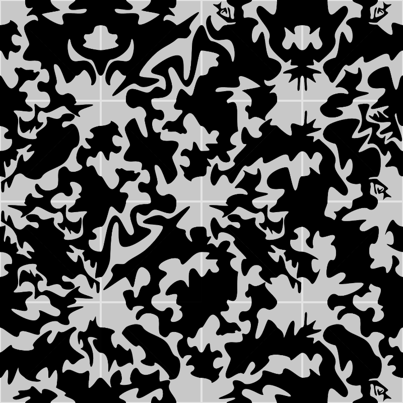

# Origami Tiling (2021)

This sketch takes a bunch of SVG tiles I've designed to be seamless, and
arranges them on the canvas into a tiling. 

The interesting thing: This is designed such that if printed, you can
fold it in various ways as in origami models and you'll still get a seamless
design.

Example output:

This p5 sketch was intended for my own use, to help me pick example layouts.
I have some ideas involving printing these tiles out as stickers to put on
origami paper or possibly 3D printed tiles.
