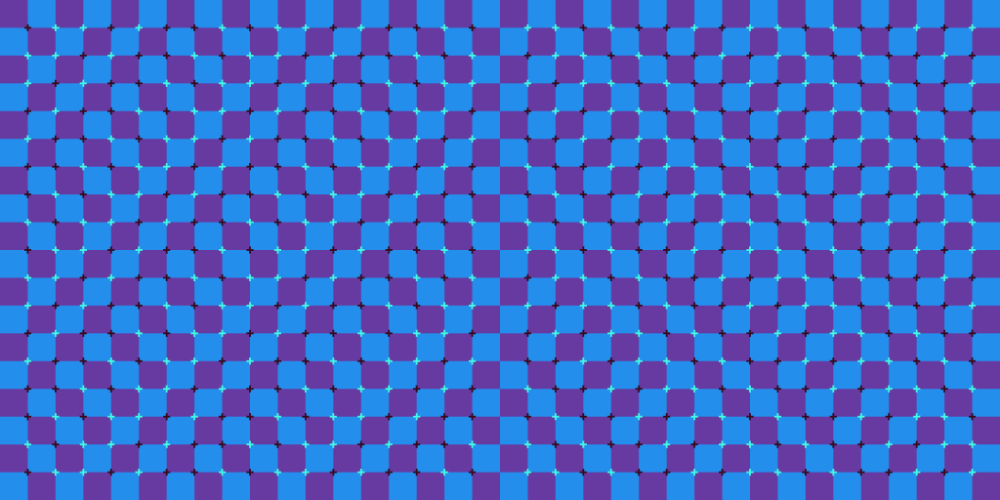
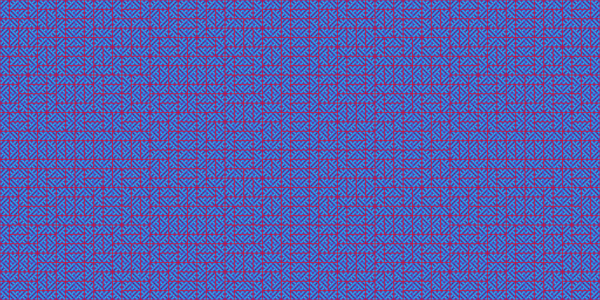
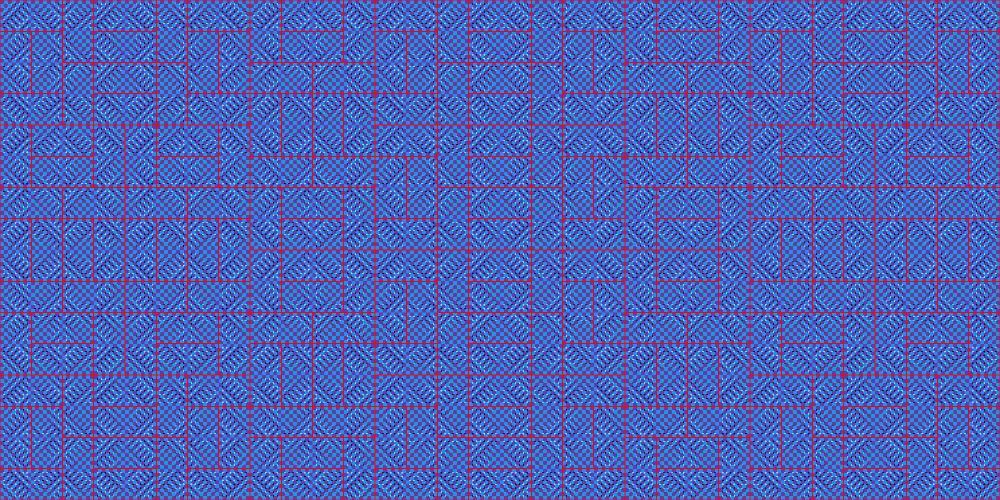
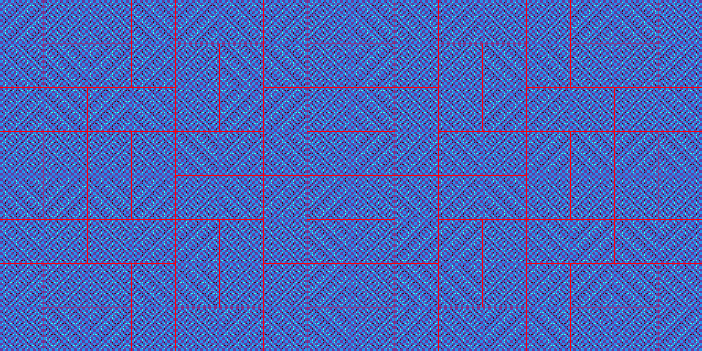
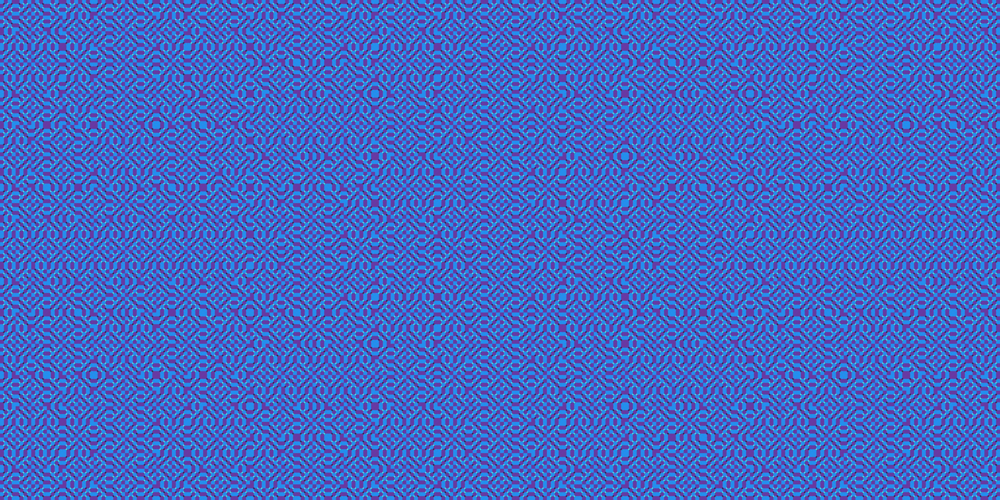
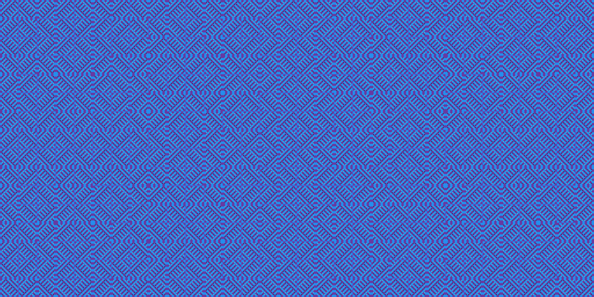
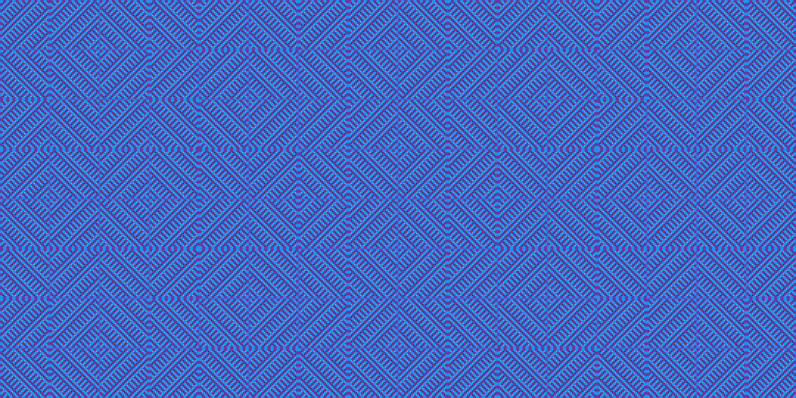

# Primrose Field Tiling

An combination of the [_Primrose Field_ illusion](https://blogs.brown.edu/sarahabdellahneuroscience/2016/08/24/primroses-field-optical-illusion/)
by Akiyoshi Kitaoka and [a rectangular tiling](https://projecteuler.net/problem=405)
I came across on Project Euler.

This was made as an art present for a friend who picked the color theme
of blues/purples/magentas.

## Contents

- [Primrose Field Tiling](#primrose-field-tiling)
  - [Contents](#contents)
  - [2020-12-22 The Basic Primrose image](#2020-12-22-the-basic-primrose-image)
    - [Next Steps](#next-steps)
  - [2020-12-26 Substitution Tiling](#2020-12-26-substitution-tiling)
    - [Transformations](#transformations)
    - [Sizing things correctly](#sizing-things-correctly)
    - [Gallery](#gallery)
  - [Retrospective](#retrospective)

## 2020-12-22 The Basic Primrose image

Today I worked on making the basic primrose pattern seen below:



This was pretty straightforward,
the background is mostly a checkerboard. The crosses' colors are picked
in a similar manner. The diagonal index `i + j` is again used but instead of
checking the parity, look up a color from a colormap.

Choosing the exact colors was a bit tricky. The important part is the
brightness of each color, but in RGB space this is kinda annoying. Maybe I
should have tried using `p5.js`'s HSV mode... heh... oh well.

The one thing I'm not quite happy about is the seam within the tile... though
maybe when I apply the broad scale tiling it will make things look more
interesting? idk, I'll have to see

### Next Steps

There's still plenty left to do:

* How can I make this primrose image more reusable? It would be good if I could
  render it _once_ to a texture/image/whatever p5 calls it, then just instance
  it.
* I also need to plan out how to handle all the transformations and recursive
  structure of the tiling. Choose a coordinate system and describe the transforms
  in that system.

I think it would be good to just focus on the latter part: use a simpler tile
(square with a slash) and build up the tiling by itself. Then go back and
fit the primrose pattern into the framework.

## 2020-12-26 Substitution Tiling

Today I added methods to generate the tiling using the deterministic fractal
rendering algorithm of Michael Barnsley. I had to adapt it for Processing
(which transforms the _coordinate system_ rather than the graphics primitives
like I'm used to)

Pseudocode of how this works in Processing:

```
def render(depth):
    if depth == 0:
        draw_tile()
        return
    
    for transform in transforms:
        push_matrix()
        apply_transform(transform)
        render(depth - 1);
        pop_matrix()
```

where `transforms` is a collection of functions that transform the root tile
to one of its children.

### Transformations

```
Parent tile

|----- 2H ------|
+---------------+  +
|     /   \     |  |
|   /       \   |  H
| /           \ |  |
+---------------+  +

Four children tiles:

+---------------+  +
| / | / D \ | \ |  H/2   (each tile has a different orientation)
| A |-------| B |  +
| \ | \ C / | / |
+---------------+

    |-- H --|
```

The transforms take the top left corner of the parent tile to the
corresponding corner of one of the child tiles. Each requires scaling to
50% of the dimensions, rotating it to have the desired orientation, and
translating it into place.

Transform | Translation | Rotation | Scale
---|---|---|---
A| `(0, H)` | 90° CCW | 1/2
B| `(2H, 0)` | 90° CW | 1/2
C| `(H/2, 0)` | 0° | 1/2
D| `(3H/2, H)` | 180° | 1/2

In the code, these are specified by `translate()` `rotate()` and `scale()`
provided by Processing. Some gotchas:

* Processing transforms the coordinate system, so you specify translation,
  rotation, scale in that order, though the transformations are applied
  in reverse order. This can feel backwards coming from other computer graphics
  environments such as WebGL
* Processing's `rotate()` function assumes positive is _clockwise_. The math
  convention is the opposite
* Processing uses a y-down coordinate system. The math convention is y-up.

No matter how often I do graphics projects, I always find these conflicting
conventions confusing.

### Sizing things correctly

The next thing to determine is how to get the scaling right. Since I'm
shrinking the coordinate system every iteration, it means I need to draw the
tiles _large_ in order for them to show up correctly on the screen. I need to
examine the dimensions closer to determine a better way to phrase it.

...

After exploring the math on paper, I found that the following method works:

* Pick a size of the smallest tile in the image. It must be large enough to
  produce the peripheral drift illusion.
* Pick the desired final image size
* Compute the scaling factor between the smallest tile and the largest tile
* Scale up the tile texture's dimensions by this scaling factor. This will
  compensate for the shrinking that happens when producing this tiling.

I experimented a bit with the smallest tile, and came up with these constraints
on the size:

* The main limiting factor is the cross at the corners of each square. If they
  get smaller than 2px thick, they become blurry or are too small to show up,
  thereby ruining the illusion. so `MIN_CROSS_WIDTH = 2`, `MIN_CROSS_LENGTH = 8`
* I wanted to make the pattern reasonably dense, so the checkerboard squares
  need to be pretty small. I found that `MIN_SQUARE_SIZE = 16` works nicely.
* Another factor in the pattern density is how many squares tall for the
  smallest tile. I found that either `8` or `16` squares per tile worked well,
  but I liked `GRID_SIZE = 16` slightly better.
* For the desired output size, I wanted to make something at approximately
  4K resolution. Since this specific tiling must have a `2:1` aspect ratio, 
  I found that `IMAGE_WIDTH = 4098`, `IMAGE_HEIGHT = 2048` was a desirable
  target.

Everything else can be computed from these. See `PrimroseTile.js` for the
details, but the key stats:

* The tile texture is `4098x2048 px`
* The texture has `16` checkerboard squares tall.
* The scaling factor is `8 = 2^3`, and so the maximum iteration depth will be
  `3` to match the desired output size of `4096x2048`

Here's some debug output for different choices of MIN_SQUARE_SIZE:

`GRID_SIZE=4`


`GRID_SIZE=8`


`GRID_SIZE=16`


### Gallery

NOTE: The images only will produce the illusion if the image is viewed at 100%.
This may be slightly larger than the screen...

`GRID_SIZE=4`


`GRID_SIZE=8`


`GRID_SIZE=16`


## Retrospective

Overall, this was a fun little experiment. Some takeaways:

* The checkerboard pattern of the Primrose Field illusion is both a blessing
  and a curse. When rotated 90 degrees, the square colors don't line up right.
  This introduces thicker grid cells into the image which look weird at large
  scales. However, this produces a _second_ illusion when viewed at 100%: 
  Because of the crosses on the corners, it gives the illusion that these
  bands of thicker cells are wavy, even though they are actually straight.
  I forget what that illusion is called.
* Compared with fractals I've done in the past, this was the first time I had
  to think about how much the individual tile shrink. This is because this is
  a tiling with a finite depth of just a few levels. I'm used to infinite
  fractals rendered with the "Chaos Game". In the infinite case, the leaves
  are never actually reached, and they would have 0 size.