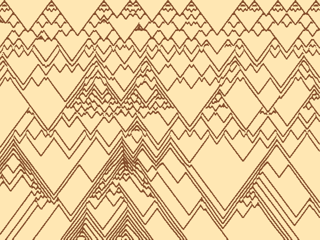

# Seashell Patterns (2021-06)

This sketch implements the activator/inhibitor model for the patterns on
certain seashells described in the 1992 SIGGRAPH paper "Modeling Seashells" by
Deborah R. Fowler, Hans Meinhardt, and Przemyslaw Prusinkiewicz.
[Link to paper](http://algorithmicbotany.org/papers/shells.sig92.pdf).

The original
[BASIC implementation](https://www.eb.tuebingen.mpg.de/emeriti/hans-meinhardt/shell-program/) 
was a helpful reference in understanding
how the differential equations are simulated. It's a little unusual, the
simulation only happens on a line, but every few iterations, the line is
added as a row of the image to simulate a growing shell.

Example output for presets:

`OLIVIA_PORPHYRIA`  - (the _Olivia porphyria_ shell described in the paper)

`LUMPY_STRIPES`:

`BLOCKY`:

