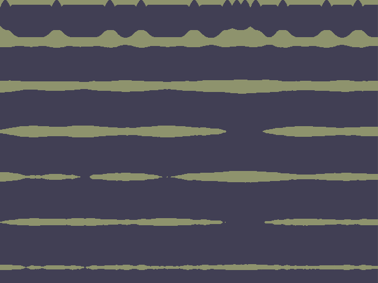
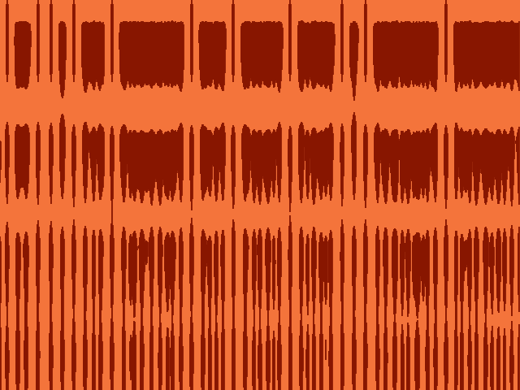
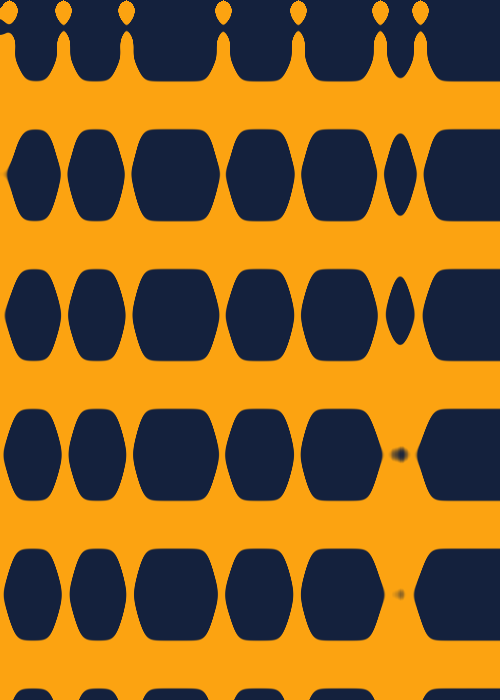
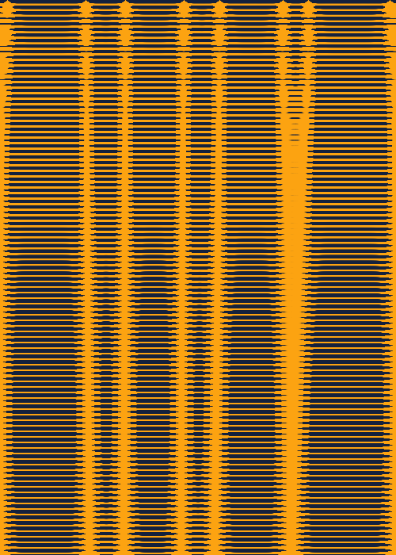
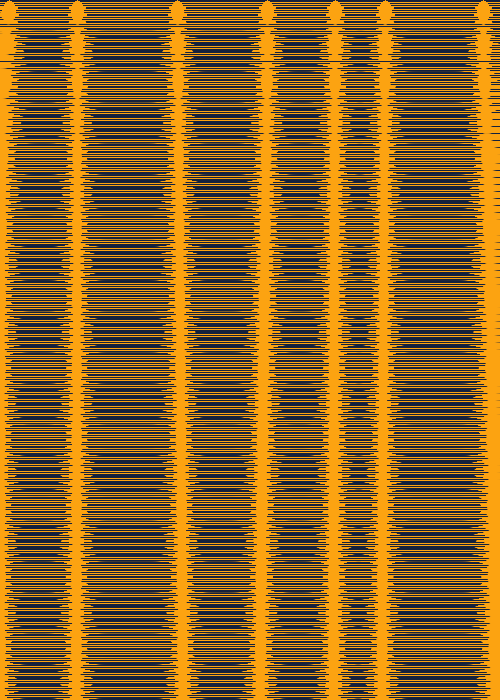

# Seashell Texture Logbook

## 2021-06-23 What I've done so far

Getting this far actually took a few sittings. I had started this sketch,
but had gotten stuck with a simulation that was getting extinguished quickly.

When mentioning this to the friend who told me about the paper in the first place, he also sent me a link to the author's [original BASIC code](https://www.eb.tuebingen.mpg.de/emeriti/hans-meinhardt/shell-program/) -- So I made
a separate sketch (not included) that ports that to JavaScript to learn how it
worked. I learned a few things:

* The shell isn't rendered every iteration, but rather every _few_ iterations
* A couple parameters from the paper weren't actually used for the _Olivia Porphyria_ shell. For example, the inhibitor production rate should be 0 in this case (which was one main cause of my incorrect implementation)
* delta time and delta x were both assumed to be 1. I find this unusual, I'm used to deltas being a small fraction. But it keeps it nice and simple.
* The original paper did some clever indexing to avoid allocating a second buffer.

After that exercise, I went back and updated my implementation. I used more descriptive variable names since there are many parameters. I also used a
double-buffering approach since memory is cheap nowadays.

After that, I started moving the parameters in to a `SeashellParemeters`
struct with defaults that indicate "no change in chemicals". This way, I
can experiment more easily, and save parameter presets as constants.

Possible Next Steps:
* Experiment with the parameters
* Experiment with the initial conditions
* Experiment with varying the parameters over time
* Try the other activator/substrate model for comparison

# 2021-07-24 First Couple Experiments

This morning I spent a little time experimenting with the parameters.
Still don't have much intuition of how the patterns will look, but made
a few interesting designs:

`LUMPY_STRIPES`:

`BLOCKY`:

One thing I've noticed is that the boundaries tend to be rather pixely. The
original BASIC program did a simple thresholding of the activator value when
picking colors. it might be good to introduce a `smoothstep` function and use
that to blend between the substrate and activator.

Another thing I'm wondering is what would happen if I mixed in the color
when the hormone value is large? Might be helpful to understand the dynamics
here.

Possible Next Steps:
* More experiments with parameters
* Try the smoothstep idea
* Try visualizing the hormone levels
* Adjust the image dimensions for a shell texture (which would be longer) and/or
    standalone images (I like making trading-card sized artworks)

## 2021-06-30 Smoothstep Experiment

Today I tried the smoothstep idea to blend the colors. Then I realized since
the sketch is rendered line-by-line, it would be fun to vary the threshold
over time with a sine wave. Results were interesting:

Threshold: `0.5 + amp * sin(2 * pi * freq * y_percent)`

| `amp=0` | `amp=1, freq=5` | `amp=1, freq=100` | `amp=1, freq=1000` |
|-------|---------------|-----------------|------------------|
|  |  |  |  |

When the threshold gets close to 0 or negative, all the activator values
pass the threshold so you get a horizontal stripe of pigment (the yellow lines
in this case). When the threshold is high, things taper off so there's mostly
substrate (the thin horizontal navy lines in this case).

This was a neat effect, something I should play with more. Maybe it should
vary a bit with horizontal position too to look more organic?

I should think about this more before I add any more parameters to the
seashell.

Next Steps:
* Try other methods of visualizing the levels of activator/substrate/hormone
* Think about how to parameterize this stripe effect