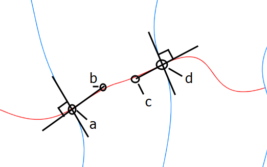

# Warped Grid (2022)

The goal of this sketch was to make curvy graph paper such
that all the grid lines are orthogonal where they intersect.

## How it works

Start with a set of vertices arranged in a grid. Now
imagine a cross at each vertex. The crosses can be rotated
in place. If you count the center of the cross and the 4
endpoints, you have 5 points per corner. Furthermore, the
4 branches of the cross meet at right angles, which is relevant
to making the orthogonal grid lines.

Now all we have to do is connect ajacent crosses with a curve
that preserves the orthogonality. Bezier curves are perfect
for this case. The endpoints are the two cross centers. The
other control points come from the cross endpoints.

This process can be repeated to connect any two adjacent
vertices. Furthermore, it works even if the crosses are
rotated or translated by small amounts